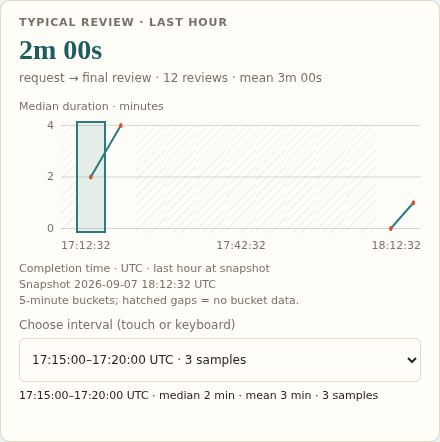
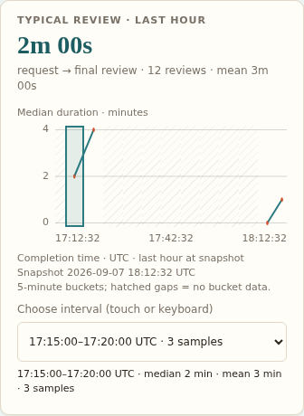

# Bay timing and retained lifecycle proof

The behavior contract was defined before product edits in [behavior-contract.md](behavior-contract.md).

## Exercised behavior

The production Bay HTML/CSS/script was served to real Chromium with controlled
same-origin API responses. Eleven browser scenarios passed, covering fixed
query-window axes, sparse/missing and real-zero buckets, hover away from dots,
keyboard focus/activation, an equivalent 44px native interval picker, mobile
containment, picker survival through unavailable polls, live-region identity,
clock skew, delayed outer status collection, and independent collapsed lifecycle
inventory. The final page SHA-256 is recorded in [summary.json](summary.json).





## Environment and reproduction

- Base source: `f633c1e10228f0a337d8852c93a7af33c4c11aac` plus this PR diff.
- Provider: Crabbox `local-container`; actual compatible engine: Podman 5.7.0.
- Lease: `cbx_77528e7476c1` (`violet-crayfish-6e04`).
- Image: `docker.io/library/node:24-bookworm`, digest `sha256:9137a20e25879e0b557227b57e3ee4e9af4bde29eb3db66134cd1723e84f830b`.
- Node: `v24.20.0`; Chromium: `152.0.7977.82`; frozen Playwright Core: `1.62.1`.
- Container prerequisites added through APT: Chromium, jq, tmux. No repository dependency changes.
- Focused producer/public-route/UI tests: 121 passed before the final browser capture.

Run from this repository in a prepared, isolated local-container:

```sh
pnpm install --frozen-lockfile
pnpm run build:all
node --test test/bay-duration-chart.test.ts test/dashboard-worker-bay-records-routes.test.ts
PLAYWRIGHT_CHROMIUM_EXECUTABLE=/usr/bin/chromium node docs/proof/bay-duration-chart/run-proof.mjs
pnpm run check
```

The browser runner writes screenshots, `trace.zip`, and its assertion/network
summary to `.artifacts/bay-duration-chart/browser/`. Full validation and review
results belong to the current PR head, not merely this base SHA.

## Data boundary and limits

`bay.timings.window_ended_at` is captured from the same `now` used for the
rolling timing query. Outer status collection can begin earlier; its freshness
time is not substituted for the query boundary. Missing timing-window timestamps
leave the chart unavailable. There is no change to timing aggregation, source
row retention, lifecycle counts, or proof-used classification. The existing
12-bucket response cap remains explicit: missing edge buckets are not zeroes.

The APIs are controlled fixtures, unrelated assets/APIs return 404, and external
font requests are blocked. This proves browser interaction and rendering behavior,
not production telemetry completeness, a live proof producer, actual GitHub
mutation, screen-reader software certification, or all-time historical coverage.
The focused route tests separately exercise the real Worker and SQLite-backed
producer/public projection.

The legacy toggle remains available. Modern inline proof stays inside normal
end-to-end timings. See [proof-toggle-feasibility.md](proof-toggle-feasibility.md)
for the separate durable telemetry needed for a truthful modern-proof comparison.
